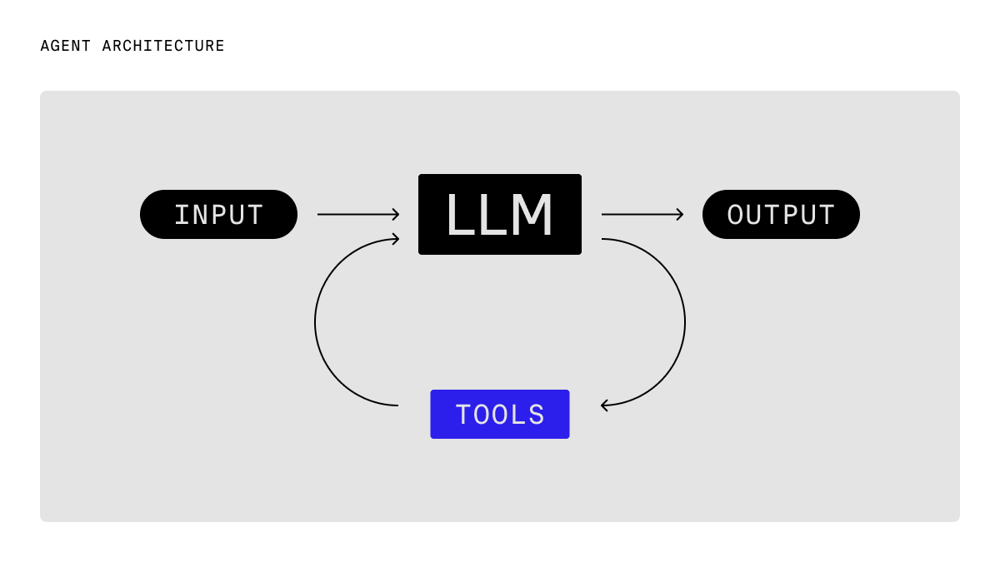
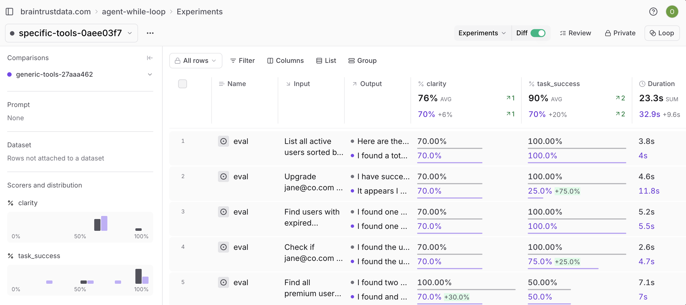

# Building Reliable AI Agents with Python

A Python implementation of the **canonical agent architecture**: a while loop with tools. This pattern provides a clean, debuggable foundation for building production-ready AI agents.

## What You'll Learn

- Implement the canonical while loop agent pattern in Python
- Build purpose-designed tools that reduce cognitive load
- Add comprehensive tracing with Braintrust
- Use async Python patterns for agent workflows
- Design tools that guide agent decision-making

## The Canonical Agent Architecture

The core pattern is straightforward and powerful:



In Python code, this translates to:

```python
while not done and iterations < max_iterations:
    # 1. Call the LLM
    response = await client.chat.completions.create(
        model=model,
        messages=messages,
        tools=tools,
    )

    # 2. Add response to conversation
    messages.append(response.choices[0].message)

    # 3. Handle tool calls or finish
    if response.choices[0].message.tool_calls:
        # Execute tools and add results
        tool_results = await execute_tools(tool_calls)
        messages.extend(tool_results)
    else:
        done = True

    iterations += 1
```

This pattern is surprisingly powerful:
- **Easy to understand and debug** - Simple loop structure
- **Scales naturally** - Handles complex multi-step workflows
- **Clear hooks for logging** - Easy to add tracing and evaluation
- **No framework overhead** - Pure Python, minimal dependencies

## Getting Started

### Prerequisites

You'll need:
- [Braintrust](https://www.braintrust.dev/signup) account with API key
- Access to an AI provider (choose one option below)

### Setup

1. **Choose your AI provider setup** (pick Option A or Option B):

   **Option A: Braintrust Proxy (Recommended)** ⭐
   - Go to [Braintrust AI Providers](https://www.braintrust.dev/app/settings?subroute=secrets)
   - Add your OpenAI API key (or other AI provider like Anthropic, etc.)
   - The Braintrust proxy will route requests through your configured provider
   - ✅ Benefit: Centralized API key management, easier to switch providers

   **Option B: Direct OpenAI Connection**
   - Get your [OpenAI API key](https://platform.openai.com/api-keys)
   - You'll add it to your `.env` file in step 3
   - ✅ Benefit: Direct connection, no proxy layer

2. **Install dependencies:**

If you're setting up from a fresh clone, sync the dependencies from the lock file:

```bash
uv sync
```

Or if you're starting from scratch, add the dependencies:

```bash
uv add openai braintrust pydantic python-dotenv
```

3. **Configure environment variables:**

Copy the example file and add your API keys:

```bash
cp .env.example .env
```

Then edit `.env` with your keys:

**If you chose Option A (Braintrust Proxy):**
```bash
BRAINTRUST_API_KEY=your-braintrust-api-key-here
# Leave OPENAI_API_KEY commented out
```

**If you chose Option B (Direct OpenAI):**
```bash
BRAINTRUST_API_KEY=your-braintrust-api-key-here
OPENAI_API_KEY=your-openai-api-key-here  # Uncomment this line
```

4. **Run the demo:**

```bash
uv run python main.py
```

This will run the customer service agent through several example queries and log them to Braintrust under the `interactive-queries` experiment.

**How it works:** The agent automatically detects which option you're using:
- If `OPENAI_API_KEY` is present → Uses direct OpenAI connection
- If only `BRAINTRUST_API_KEY` is present → Uses Braintrust proxy

5. **Run the tool comparison evaluation (optional):**

```bash
uv run python tool_comparison_eval.py
```

This will compare purpose-built tools vs generic tools and show you the performance difference in the Braintrust dashboard.

## Project Structure

```
.
 src/
    __init__.py          # Package initialization
    agent.py             # WhileLoopAgent implementation
    tools.py             # Purpose-built tools
    user_service.py      # Business logic layer
    user_data.py         # Mock data models
 main.py                  # Entry point with examples
 .env                     # Environment variables
 README.md
```

## Building the Agent

### Core Agent Class

The `WhileLoopAgent` class implements the canonical pattern:

```python
from braintrust import wrap_openai, start_span
from openai import AsyncOpenAI

class WhileLoopAgent:
    def __init__(self, options: AgentOptions):
        # Wrap OpenAI client with Braintrust tracing
        self.client = wrap_openai(
            AsyncOpenAI(
                api_key=options.openai_api_key,
                base_url="https://api.braintrust.dev/v1/proxy",
            )
        )
        self.tools = {tool.name: tool for tool in options.tools}
        self.model = options.model
        self.max_iterations = options.max_iterations

    async def run(self, user_message: str) -> str:
        with start_span(name="agent_run", type="task") as span:
            messages = [
                {"role": "system", "content": self.system_prompt},
                {"role": "user", "content": user_message},
            ]

            iterations = 0
            done = False

            # The canonical while loop
            while not done and iterations < self.max_iterations:
                response = await self.client.chat.completions.create(
                    model=self.model,
                    messages=messages,
                    tools=self._format_tools_for_openai(),
                )

                message = response.choices[0].message
                messages.append(message.model_dump(exclude_unset=True))

                if message.tool_calls:
                    # Execute tools and add results
                    tool_results = await self._execute_tools(message.tool_calls)
                    messages.extend(tool_results)
                elif message.content:
                    done = True

                iterations += 1

            return self._extract_final_response(messages)
```

### Tool Design Philosophy

⚠️ **What NOT to do** - Generic API wrappers:

```python
# ❌ DON'T DO THIS - Generic email API wrapper
class BadEmailSchema(BaseModel):
    to: str = Field(..., description="Recipient email address")
    from_: str = Field(..., description="Sender email address")
    subject: str = Field(..., description="Email subject line")
    body: str = Field(..., description="Email body content")
    cc: list[str] | None = Field(None, description="CC recipients")
    bcc: list[str] | None = Field(None, description="BCC recipients")
    reply_to: str | None = Field(None, description="Reply-to address")
    headers: dict[str, str] | None = Field(None, description="Custom headers")
    # ... 10+ more parameters that confuse the agent
```

✅ **What to DO** - Purpose-built tools:

```python
# ✅ DO THIS - Purpose-built for customer notifications
class NotifyCustomerSchema(BaseModel):
    customerEmail: str = Field(..., description="Customer's email address")
    message: str = Field(..., description="The update message to send")

notify_customer_tool = Tool(
    name="notify_customer",
    description="Send a notification email to a customer about their order or account",
    parameters=NotifyCustomerSchema,
    execute=notify_customer_execute,
)
```



**Why purpose-built tools are better:**
- **Reduced cognitive load** - Agent has fewer parameters to think about
- **Better abstractions** - Hide infrastructure complexity
- **Guided workflows** - Tool output suggests next actions
- **Higher reliability** - Less room for errors

### Customer Service Tools

Our agent includes four purpose-built tools:

1. **`notify_customer`** - Send targeted notifications (not a generic email API)
2. **`search_users`** - Find users with business-relevant filters
3. **`get_user_details`** - Get comprehensive user information
4. **`update_subscription`** - Handle subscription changes

Each tool returns human-readable output that guides the agent:

```python
async def search_users_execute(args: SearchUsersSchema) -> str:
    result = await UserService.search_users(
        SearchUsersParams(
            query=args.query,
            subscription_plan=args.subscriptionPlan,
            subscription_status=args.subscriptionStatus,
        )
    )
    # Return formatted output that guides next actions
    return (
        result.formatted
        + "\n\nNeed more details? Use 'get_user_details' with the user's email."
    )
```

## Running the Agent

Initialize and run the agent:

```python
import asyncio
from dotenv import load_dotenv
import braintrust

from src.agent import WhileLoopAgent, AgentOptions
from src.tools import get_all_tools

load_dotenv()

async def main():
    # Initialize Braintrust
    braintrust.init(project="canonical-agent-customer-service")

    # Create agent with purpose-built tools
    agent = WhileLoopAgent(
        AgentOptions(
            model="gpt-4o-mini",
            system_prompt="""You are a helpful customer service agent. You can:

1. Search for users by name, email, or subscription details
2. Get detailed information about specific users
3. Send email notifications to customers
4. Update subscription plans and statuses

Always be polite and helpful. When you need more information, ask clarifying questions.
When you complete an action, summarize what you did for the customer.""",
            tools=get_all_tools(),
            max_iterations=10,
            openai_api_key=os.getenv("BRAINTRUST_API_KEY"),
        )
    )

    # Run example queries
    queries = [
        "Find all premium users with expired subscriptions",
        "Get details for john@co.com and send them a renewal reminder",
        "Cancel the subscription for jane@co.com",
    ]

    for query in queries:
        print(f"Query: {query}")
        response = await agent.run(query)
        print(f"Response: {response}\n")

asyncio.run(main())
```

## Evaluating Tool Design: Specific vs Generic

One of the key insights from the canonical agent architecture is that **purpose-built tools significantly outperform generic API wrappers**. This project includes an evaluation to prove this empirically.

### Running the Comparison

```bash
uv run python tool_comparison_eval.py
```

This runs the same test cases with two different tool sets:

1. **Specific tools** (`tools.py`) - Purpose-built for customer service tasks
2. **Generic tools** (`generic_tools.py`) - Over-engineered API wrappers

### What Gets Measured

The evaluation uses two scorers:

- **`task_success`** - Did the agent accomplish what was asked?
- **`clarity`** - Is the output clear, structured, and user-friendly?

### Expected Results


**Purpose-built tools win because:**
- ✅ Less parameters = less confusion for the agent
- ✅ Better abstractions match the agent's mental model
- ✅ Helpful output guides the agent to next actions
- ✅ Fewer error modes = higher reliability

**Generic tools struggle because:**
- ❌ Too many parameters overwhelm the agent
- ❌ Generic abstractions don't match use cases
- ❌ Technical output doesn't guide decision-making
- ❌ Many failure modes lead to errors

View the full results in your [Braintrust dashboard](https://www.braintrust.dev/app) after running the evaluation.

## Tracing and Observability

The implementation includes comprehensive tracing with Braintrust:

- **Agent runs** - Full conversation history and metrics
- **Individual iterations** - Each loop iteration is traced
- **Tool calls** - Detailed tool execution logs
- **Performance metrics** - Duration, token usage, costs
- **Error tracking** - Capture and debug failures

View traces in the [Braintrust dashboard](https://www.braintrust.dev/app) to:
- Debug agent decision-making
- Identify performance bottlenecks
- Build evaluation datasets from real usage
- Compare different tool designs

## Key Implementation Details

### Using Braintrust Proxy

The agent uses Braintrust's AI proxy to route requests through your configured AI provider:

```python
client = wrap_openai(
    AsyncOpenAI(
        api_key=os.getenv("BRAINTRUST_API_KEY"),  # Use Braintrust API key
        base_url="https://api.braintrust.dev/v1/proxy",  # Route through proxy
    )
)
```

### Async Python Patterns

The implementation uses `AsyncOpenAI` for proper async support:

```python
# Use AsyncOpenAI, not OpenAI
from openai import AsyncOpenAI

# Await API calls
response = await self.client.chat.completions.create(...)

# Await tool execution
result = await tool.execute(validated_args)
```

### Braintrust Tracing

Tracing uses context managers and keyword arguments:

```python
# Use start_span context manager
with start_span(name="agent_run", type="task") as span:
    # Log with keyword arguments, not dicts
    span.log(input=user_message)
    span.log(output=result, metrics={"iterations": count})
```

### Pydantic for Schema Validation

Tools use Pydantic for parameter validation:

```python
from pydantic import BaseModel, Field

class SearchUsersSchema(BaseModel):
    query: str | None = Field(None, description="Search query")
    subscriptionPlan: str | None = Field(None, description="Filter by plan")

# Validate args automatically
validated_args = tool.parameters(**json.loads(tool_call.arguments))
result = await tool.execute(validated_args)
```

## Next Steps

Start building your own while loop agent:

1. **Pick a specific use case** - Customer service, data analysis, etc.
2. **Design 2-3 purpose-built tools** - Focus on what the agent needs
3. **Implement the while loop** - Use this codebase as a template
4. **Add tracing** - Log everything for debugging and evaluation
5. **Iterate based on usage** - Build evaluation datasets from real traces

### Additional Resources

- [Braintrust Python SDK](https://www.braintrust.dev/docs/reference/python)
- [Agent While Loop Pattern (Blog)](https://www.braintrust.dev/blog/agent-while-loop)
- [OpenAI Python SDK](https://github.com/openai/openai-python)
- [Pydantic Documentation](https://docs.pydantic.dev/)

## License

MIT
